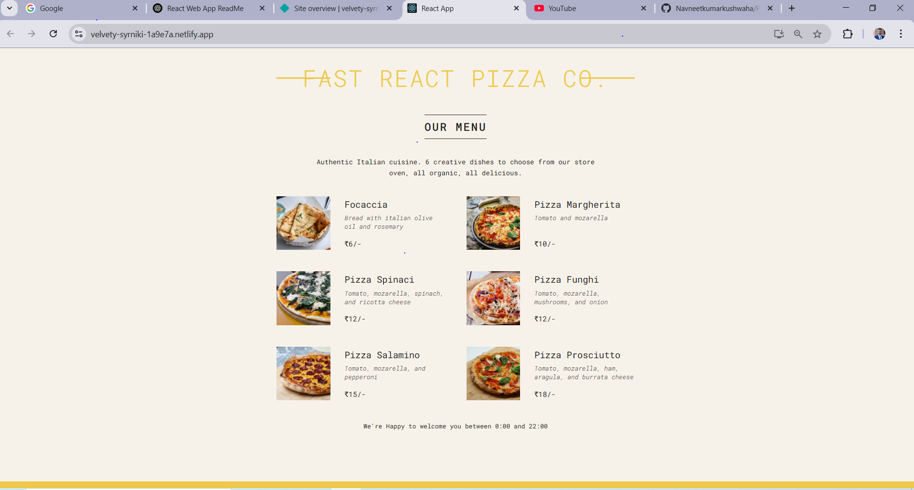

# React Web Application

## Overview
This is Simple Small Pizza Application.

## Images



## Installation

### Prerequisites
- Node.js (>= 14.x)
- npm or yarn

### Steps
1. Clone the repository:
   ```sh
   git clone https://github.com/Navneetkumarkushwaha/Pizza-App-ReactLearning.git
   ```
2. Navigate to the project directory:
   ```sh
   cd your-repo
   ```
3. Install dependencies:
   ```sh
   npm install
   ```
   or
   ```sh
   yarn install
   ```

## Running the Application
To start the development server, run:
```sh
npm start
```
or
```sh
yarn start
```

This will start the app in development mode, and it will be accessible at `http://localhost:3000/`.

## Build for Production
To create a production build, run:
```sh
npm run build
```
or
```sh
yarn build
```

## Deployment
You can deploy this application using services like Vercel, Netlify, or GitHub Pages.

## Technologies Used
- React
- [Other libraries/frameworks used]

## License
This project is licensed under the [Your License] License.

## Contact
For any inquiries, contact [your-email@example.com] or visit [your-website].

